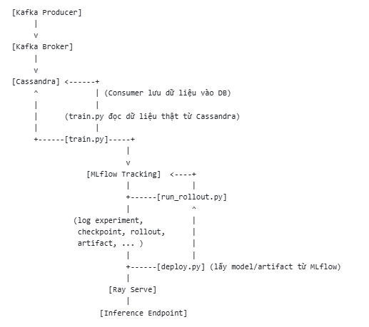

# MLFlow system
# 🧠 Reinforcement Learning System Pipeline

Quy trình gồm 6 bước chính:

1. [Khởi động hạ tầng (infra)](#1-khởi-động-hạ-tầng-infra)  
2. [Sinh dữ liệu vào Kafka (data_pipeline)](#2-sinh-dữ-liệu-vào-kafka-data_pipeline)  
3. [Huấn luyện mô hình RL (marl_training)](#3-huấn-luyện-mô-hình-rl-marl_training)  
4. [Đánh giá / Rollout mô hình](#4-đánh-giá--rollout-mô-hình)  
5. [Triển khai inference API (ray_workflow)](#5-triển-khai-inference-api-ray_workflow)  
6. [Gửi request tới API inference](#6-gửi-request-tới-api-inference)

---

## 1. Khởi động hạ tầng (infra)

Chạy các service cần thiết:
- `Kafka` / `Redpanda`
- `Cassandra`
- `MLflow Server`

📌 **Cách chạy**:

docker-compose -f infra/docker-compose.yml up -d

Đảm bảo các service đều đang chạy(`docker ps`).

## 2. Sinh dữ liệu vào Kafka (data_pipeline)

-  Sinh dữ liệu giả lập vào Kafka:
  `python data_pipeline/kafka_producer.py --n 10`

-  (Tùy chọn) Đọc dữ liệu từ Kafka và ghi vào Cassandra:
  `python data_pipeline/kafka_consumer.py`

-  Ý nghĩa: Mô phỏng dữ liệu môi trường thực cho hệ RL.

## 3. Huấn luyện mô hình RL (marl_training)

-  Chạy huấn luyện agent PPO trên môi trường multi-agent:
  `python marl_training/train.py`

-  Kết quả:
    Checkpoint mô hình được lưu (và nén).
    Log kết quả, tham số, artifact lên MLflow.
    Có thể xem kết quả tại http://localhost:5000.

## 4. Đánh giá/rollout mô hình (marl_training)

-  Chạy rollout để kiểm tra agent đã học:
  `python marl_training/run_rollout.py`

-  Kết quả:
    In ra các bước di chuyển, action, reward của agent theo từng vòng lặp.

## 5. Triển khai inference API (ray_workflow)

-  Chạy pipeline huấn luyện + triển khai inference API:
  `python ray_deploy.py`

-  Kết quả:
    Ray Serve khởi động endpoint inference tại http://localhost:8000/predict.

## 6. Gửi request tới API inference
-  Gửi request tới endpoint để lấy action dự đoán:
  curl -X POST -H "Content-Type: application/json" -d "{\"agent_0\": [0,0], \"agent_1\": [1,1]}" http://localhost:8000/predict

-  Kết quả:
    Nhận về action dự đoán cho từng agent.

# Tóm tắt luồng demo
Khởi động hạ tầng:
  docker-compose up -d
Sinh dữ liệu:
  python [kafka_producer.py](http://_vscodecontentref_/0) --n 100
Huấn luyện mô hình:
  python marl_training/train.py
Đánh giá mô hình:
  python marl_training/run_rollout.py
Triển khai inference API:
  python ray_workflow/deploy.py
Gửi request inference:
  curl ... http://localhost:8000/predict

Kết quả cuối cùng:

  Có thể huấn luyện, đánh giá, và phục vụ mô hình RL đa tác tử trên dữ liệu thực/giả lập, theo dõi kết quả trên MLflow, và inference qua API.

# Luồng mới: 
- Dữ liệu sinh ra từ producer gửi vào Kafka, consumer lấy và ghi vào Cassandra.
- Tập huấn luyện (train.py) lấy dữ liệu từ Cassandra để train mô hình RL (offline RL hoặc imitation learning).
- train.py log đầy đủ thông tin lên MLflow: tham số, mô hình, artifact, batch dữ liệu đã train.
- run_rollout.py thực hiện rollout với checkpoint đã train, log kết quả vào cùng MLflow run.
- deploy.py lấy model/artifact từ MLflow, triển khai lên Ray Serve.
